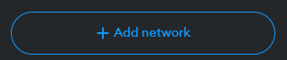
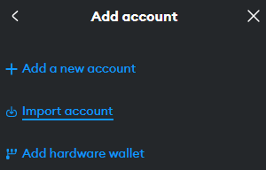
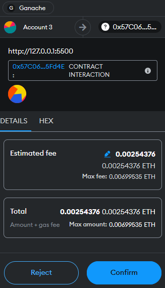

# Electioneer

A blockchain solution for secure and transparent voting.

## Table of Contents

1. [Getting Started](#getting-started)
2. [Guide](#guide)
3. [Technologies](#technologies)

## Getting Started

### Prerequisites

Before running, ensure you have the following installed:

1. **[Node.js](https://nodejs.org/)**: JavaScript runtime with npm (Node Package Manager).
2. **[Ganache](https://trufflesuite.com/ganache/)**: Local Ethereum blockchain for testing.
3. **Truffle**: Install with npm:
   ```bash
   npm install -g truffle
   ```
4. **[MetaMask](https://metamask.io/)**: Browser wallet to interact with the blockchain.
5. **Local Server**: Install with npm:
   ```bash
   npm install -g http-server
   ```
6. **[Firefox](https://www.mozilla.org/en-US/firefox/new/?gad_source=1&gclid=Cj0KCQiApNW6BhD5ARIsACmEbkUlgNBYWfrP3wyR9NmGqGixfWBUJ-zoVAg0m5lOsRxyLRenL5dA0UIaAkEkEALw_wcB)** or **[Chrome](https://www.google.com/chrome/?brand=QCTP&gad_source=1&gclid=Cj0KCQiApNW6BhD5ARIsACmEbkUaQO5p_oTU3dZ_FtsB3CPu6ChC8u8GkH4maRU3UtIfwukU8l03U_YaAsSKEALw_wcB&gclsrc=aw.ds)**

### Deploying to Ganache

Clone this repository from GitHub by downloading the .zip or using your preferred method.

Next, create a new workspace in Ganache by clicking the "New Workspace" button:


Link your Ganache project to Electioneer by clicking "Add Project" and selecting the truffle-config.js file:


The fully configured Ganache project should look like this:


Click start to run your local blockchain, then run the following command to deploy:

```bash
truffle migrate
```

Once deployed, copy the Electioneer contract address:


Paste it into line 5 of the ethereum.js file:


Start the local server by running http-server:

```bash
http-server
```

Navigate to the local IP address and port where the server has started in a web browser.

### Connecting with Metamask

To connect with Metamask, click the dropdown list on the top left corner:


Click "Add network":



Click "Add a network manually":


Fill in the network details to match Ganache and click "Save":


To import an account to Metamask, navigate to the Ganache Accounts tab and click on the key symbol next to any account:


Copy the private key:


In Metamask, click the dropdown next to your current account


Click "Add account or hardware wallet":


Click "Import account":



Paste the private key into the text box and click "Import":


When prompted to connect, check the account you imported and click "Next". You may have to refresh the page:


When prompted, click "Confirm" to allow permissions:


You will now be able to confirm transactions when using Electioneer by clicking "Confirm" when prompted:



## Guide

### All

Allows viewing and filtering all the ballots on the blockchain:


### My Ballots

Click the New button to open a ballot creation window:


Click on a ballot to open a management window:


### Authorized

Click on a ballot from the list displayed below to open the voting window:


Click on a proposal and click "Vote" to cast your vote:


Once a ballot has finished you may view the winner(s) (you may need to create another transaction on the blockchain to get Ganache to refresh):


Click on a proposal to view which address cast their vote in its favor:


## Technologies

- **Browsers**: Firefox, Chrome
- **IDE**: VSCode
- **Frontend Languages**: HTML, CSS, JavaScript
- **Backend Language**: Solidity
- **Blockchain**: Ethereum
- **Version Control**: Git / GitHub
- **Wallet**: Metamask
- **Services**: Node.js, Truffle, http-server
